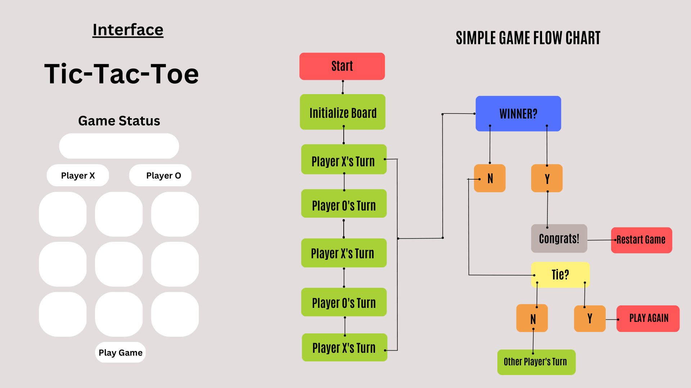

<h1>Introduction</h1>

Are you ready to play a classic game? Tic-Tac-Toe, also known as Noughts and Crosses, is a timeless game played by two players on a 3x3 grid. This project is all about creating a fun and interactive version of Tic-Tac-Toe that you can play with a friend on the same computer. By leveraging HTML, CSS, vanilla JavaScript, and DOM manipulation, I've created a dynamic game that is easy to play and visually appealing while following best coding practices (Don't Repeat Yourself). So, get ready to experience the classic game like never before.

<h2>Installation</h2>

No installation is needed to play the game. The application can be played in the browser of your choice by clicking
the following link: (*Add deployed page*)

<h1>The Planning Process</h1>
<h2>Prioritizing the User Stories</h2>

Planning before writing code and starting a project is crucial to ensure its success. This process helps define the project's objectives, identify the requirements, and reduce scope creep. As a developer, I started by identifying the MVP (Minimum Viable Product); the bare minimum required to deliver the desired outcome.

In the case of building a Tic-Tac-Toe board, the acceptable MVP consists of an HTML page with a table of nine cells, enough Javascript to display the current player, and a touch of CSS to make the cells visible. Focusing on the MVP first allowed me to get a good understanding of the required <strong>user stories</strong> needed to build the game:
<ul>
<li>As a user, I should be able to start a new tic tac toe game.</li>
<li>As a user, I should be able to click on a square to add X first and then O, and so on.</li>
<li>As a user, I should be shown a message after each turn for if I win, lose, tie or who's turn it is next.</li>
<li>As a user, I should not be able to click the same square twice.</li>
<li>As a user, I should be shown a message when I win, lose or tie.</li>
<li>As a user, I should not be able to continue playing once I win, lose, or tie.</li>
<li>As a user, I should be able to play the game again without refreshing the page.</li>
</ul>

<h2>Wireframing</h2>

Developing a successful game requires proper planning and attention to detail. Before jumping into the code, I created a basic wireframe to visualize the game's interface and identify potential challenges and areas for optimization. Breaking down each component individually helped me to analyze the user experience and ensure that each aspect of the interface would work together seamlessly. To further refine the game's logic, I also created a basic Tic-Tac-Toe flow chart. These techniques enabled me to design a game that not only met the project's objectives but also delivered an enjoyable user experience.

