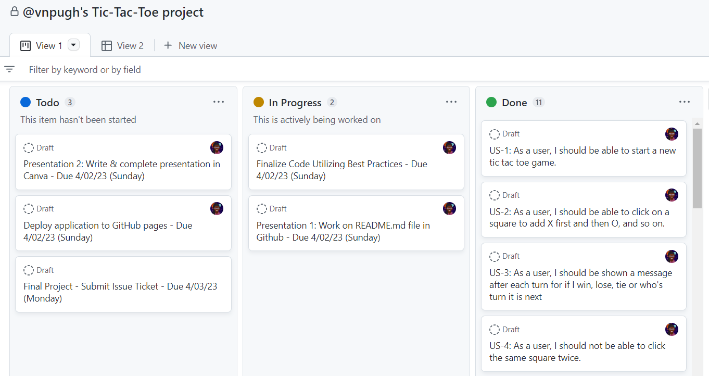

\*Table of Contents -> automatically generated in the markdown

<h1>Introduction</h1>

Are you ready to play a classic game? Tic-Tac-Toe, also known as Noughts and Crosses, is a timeless game played by two players on a 3x3 grid. This project is all about creating a fun and interactive version of Tic-Tac-Toe that you can play with a friend on the same computer. By leveraging HTML, CSS, vanilla JavaScript, and DOM manipulation, I've created a dynamic game that is easy to play and visually appealing while following best coding practices (Don't Repeat Yourself). So, get ready to experience the classic game like never before.

<h2>Installation</h2>

No installation is needed to play the game. The application can be played in the browser of your choice by clicking
the following link: (*Add deployed page*)

<h1>The Planning Process</h1>
<h2>Prioritizing the User Stories</h2>

Planning before writing code and starting a project is crucial to ensure its success. This process helps define the project's objectives, identify the requirements, and reduce scope creep. As a developer, I started by identifying the MVP (Minimum Viable Product); the bare minimum required to deliver the desired outcome.

In the case of building a Tic-Tac-Toe board, the acceptable MVP consists of an HTML page with a table of nine cells, enough Javascript to display the current player, and a touch of CSS to make the cells visible. Focusing on the MVP first allowed me to get a good understanding of the required <strong>user stories</strong> needed to build the game:
<ul>
<li>As a user, I should be able to start a new tic tac toe game.</li>
<li>As a user, I should be able to click on a square to add X first and then O, and so on.</li>
<li>As a user, I should be shown a message after each turn for if I win, lose, tie or who's turn it is next.</li>
<li>As a user, I should not be able to click the same square twice.</li>
<li>As a user, I should be shown a message when I win, lose or tie.</li>
<li>As a user, I should not be able to continue playing once I win, lose, or tie.</li>
<li>As a user, I should be able to play the game again without refreshing the page.</li>
</ul>

<h2>Wireframing</h2>

A successful game requires preparation and close attention to detail. I made a simple wireframe of the game's interface before diving into the code to help me visualize likely issues and areas for improvement. I was able to evaluate the user experience and make sure that every element of the interface would function in unison by dissecting each component separately.

I also made a simple Tic-Tac-Toe flow chart to further polish the game's reasoning. This method was also useful for writing the game's pseudocode. Overall, this gave me the ability to create a game that not only achieved the project's goals but also provides a positive user experience.

<h2>Project Management</h2>
I prioritized the user stories using the Projects tool in GitHub after building the UI wireframe, flowchart, and analyzing the necessary user stories. This method was very useful because it allowed me to keep track of my progress by grouping and sorting the user stories according to their level of difficulty.

<h1>Building the Game</h1>
 <h2>Technical Requirements</h2>
 <ul>
<li>Build a web application from scratch with semantic markup for HTML, CSS & JavaScript (DOM manipulation).</li>
<li>Build a dynamic game that allows two players to compete from the same computer.</li>
<li>Separate HTML, CSS, and JavaScript files in the application.</li>
<li>Leverage DRY (Don't Repeat Yourself) principles.</li>
<li>The application renders in various browsers (Chrome & Edge) and runs without errors.</li>
<li> The project should be deployed to GitHub Pages or a custom domain.</li>
<li>The repo must have a README that adequately documents the project.</li>
</ul>
