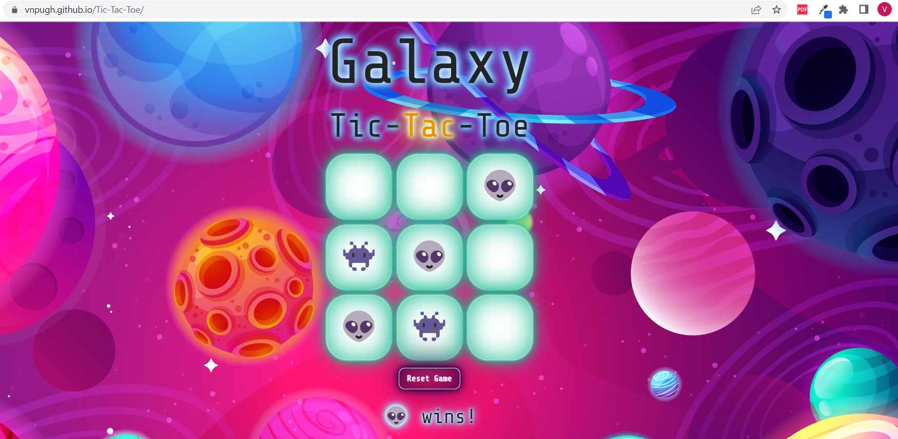

<h1>Galaxy Tic-Tac-Toe🪐</h1>
<h1>Introduction📝</h1>

Are you ready to play a classic game? Tic-Tac-Toe, also known as Noughts and Crosses, is a timeless game played by two players on a 3x3 grid. This project is all about creating a fun and interactive version of Tic-Tac-Toe that you can play with a friend on the same computer. By leveraging HTML, CSS, vanilla JavaScript, and DOM manipulation, I've created a dynamic game that is easy to play and visually appealing while following best coding practices (Don't Repeat Yourself). So, get ready to experience the classic game like never before.

<h2>Installation</h2>

No installation is needed to play the game. The application can be played in the browser of your choice by clicking
the following link: https://vnpugh.github.io/Tic-Tac-Toe/

<h1>The Planning Process🖋️</h1>
<h2>Prioritizing the User Stories⏲️</h2>

Planning before writing code and starting a project is crucial to ensure its success. This process helps define the project's objectives, identify the requirements, and reduce scope creep. As a developer, I started by identifying the MVP (Minimum Viable Product); the bare minimum required to deliver the desired outcome.

In the case of building a Tic-Tac-Toe board, the acceptable MVP consists of an HTML page with a table of nine cells, enough Javascript to display the current player, and a touch of CSS to make the cells visible. Focusing on the MVP first allowed me to get a good understanding of the required <strong>user stories</strong> needed to build the game:
<ul>
<li>As a user, I should be able to start a new tic tac toe game.✅</li>
<li>As a user, I should be able to click on a square to add X first and then O, and so on.✅</li>
<li>As a user, I should be shown a message after each turn for if I win, lose, tie or who's next.✅</li>
<li>As a user, I should not be able to click the same square twice.✅</li>
<li>As a user, I should be shown a message when I win, lose or tie.✅</li>
<li>As a user, I should not be able to continue playing once I win, lose, or tie.✅</li>
<li>As a user, I should be able to play the game again without refreshing the page.✅</li>
</ul>

<h2>Wireframing🔌</h2>

A successful game requires preparation and close attention to detail. I made a simple wireframe of the game's interface before diving into the code to help me visualize likely issues and areas for improvement. I was able to evaluate the user experience and make sure that every element of the interface would function in unison by dissecting each component separately.

I also made a simple Tic-Tac-Toe flow chart to further polish the game's reasoning. This method was also useful for writing the game's pseudocode. Overall, this gave me the ability to create a game that not only achieved the project's goals but also provides a positive user experience.

<h2>Project Management🚧</h2>
I prioritized the user stories using the Projects tool in GitHub after building the UI wireframe, flowchart, and analyzing the necessary user stories. This method was very useful because it allowed me to keep track of my progress by grouping and sorting the user stories according to their level of difficulty.

<h1>Building the Game🦾</h1>
 <h2>Technical Requirements🏁</h2>
 <ul>
<li>Build a web app from scratch with semantic markup for HTML, CSS & JavaScript (DOM manipulation).✅</li>
<li>Build a dynamic game that allows two players to compete from the same computer.✅</li>
<li>Separate HTML, CSS, and JavaScript files in the application.✅</li>
<li>Leverage DRY (Don't Repeat Yourself) principles.✅</li>
<li>The application renders in various browsers (Chrome & Edge) and runs without errors.✅</li>
<li> The project should be deployed to GitHub Pages or a custom domain.✅</li>
<li>The repo must have a README that adequately documents the project.✅</li>
</ul>
 <h2>Technologies & Tools Used 🛠️</h2>
<ul>
 <li><strong>Project Management</strong></li>
 📋Github Projects (Kanban Board)
 <li><strong>Version Control</strong></li>
 🕛GitHub
 <li><strong>Developer Tools</strong></li>
⬛Git Bash (Command Line)
⬛Visual Studio Code (Text Editor)
💻Chrome Developer Tools
 <li><strong>Wireframing</strong></li>
 🎨Canva
 <li><strong>Languages & Frameworks</strong></li>
➕HTML
➕CSS
➕Bootstrap (CSS Framework)
➕JavaScript
 <li><strong>Royalty Free Images, Fonts & Audio</strong></li>
🖼️Pixabay
 ➰Google Fonts
 🎵Soundstripe
 <li><strong>Deployment</strong></li>
 🖥️GitHub Pages
</ul>
 <h2>Project Challenges😖😣🍷</h2>

◾One hurdle for me was figuring out how to implement some of the GOLD product features such as local storage and playing against the computer (AI). This was frustrating because I wanted to add these advanced features to the finished product, but time was not on my side. I needed more time to research the implementation process and to write the code.

◾Another obstacle I faced in creating my Tic Tac Toe game was figuring out how to make the winning path line highlight for each player. I thought I had it figured out by creating the winningMoves array, which checked for a win on the game board. But then, I hit a wall when it came to highlighting the winning path itself. After some brainstorming, I realized that I could use the unique ID I had assigned to each cell to create a CSS class for the winning combination, and then assign a unique color or style to each winning cell based on the player. While I didn't quite crack this puzzle during the project, I've added it to my Icebox as a challenge to revisit later. 

◾Finally, CSS styling was another challenge during this project. I had envisioned a vibrant, gradient background with perfectly positioned buttons. However, CSS can be quite tricky and requires a lot of trial and error to get the desired layout. To overcome this obstacle, I made the decision to incorporate Bootstrap styling for the 'Reset Game' button and opted for a full-width image to serve as the background. By doing so, I was able to achieve the aesthetic I was aiming for while saving myself a great deal of time and frustration in the process.

 <h2>Project Wins🏆</h2>

◾Leveraging the project tools in Github proved to be a huge win for me! As someone who isn't quick to dive into coding, I require structure and guidance with a clear plan of action complete with start and due dates to keep me on track. I'm proud to say that by committing my work to Github regularly, I was able to meet all of my project deadlines and achieved a great sense of accomplishment throughout the process.

◾I'm thrilled to say that I was able to take my game beyond the MVP (Minimum Viable Product) stage and create a fully functional, interactive experience. One of my biggest accomplishments was incorporating audio and emoji features that took the game to a whole new level. By conducting thorough research and careful planning, I was able to push the product features to a SILVER level, exceeding my initial expectations. I'm extremely proud of the end result and the amount of effort that went into making it happen.

<h1>The Finished Product📱</h1>
<h2>Galaxy Tic-Tac-Toe🛸</h2>
<h4>Desktop Screenshot</h4>

<h4>Tablet Screenshots</h4>

<h4>Mobile (iPhone) Screenshot</h4>

<h2>Current Features👽</h2>
<ul>
<li>Meet Player X (👽) and Player O (👾), the fun-loving emojis that will bring life to your game!</li>
<li>Listen to the satisfying clicks as you choose your cells and reset the game for another round of exciting gameplay!</li>
<li>Watch the cells light up in purple as you hover over them with your cursor.</li>
<li>Celebrate your victories with a unique sound for each player, adding to the thrilling experience of the game!</li>
<li>Get ready for personalized messages that will let you know if you've won or if the game ends in a tie!</li>
<li>Refresh and start a new game with ease by simply clicking on the 'Reset Game' button.</li>
<li>Play wherever you want, whenever you want, as the game is fully responsive and will adapt to any device you use, whether it's a desktop,
tablet or mobile phone.</li>
</ul>
<h1>What I Learned📚</h1>

◾Through the use of the MDN Web Docs, I have significantly enhanced my understanding of JavaScript, far beyond the rudimentary fundamentals. Specifically, the checkForWin function in my code employs a sophisticated technique known as <a href="https://developer.mozilla.org/en-US/docs/Web/JavaScript/Reference/Operators/Destructuring_assignment">Destructuring assignment</a> (binding pattern) to assign the values of a combination to variables [a, b, c]. 

◾This approach then leverages the textContent property to verify whether the current player's symbol appears in all three corresponding cells. 
This logic function is important, as it enables the checking of a win in three possible directions: horizontal, vertical, and diagonal, while utilizing an array pattern instead of multiple IF statements, resulting in a more functional code structure. 

◾Additionally, this project has given me a better grasp of how to manipulate the DOM, create event listeners to detect a player's click on a cell on the game board, and write a function that checks for different outcomes like a win, tie, or loss. 

<h1>Icebox🧊</h1>
<h3>Here are some features I would like to implement in the future:</h3>
<ul>
<li>Create a score board to keep track of each player's scores.</li>
<li>Add local storage to store data permanently in a web browser to play the game offline.</li>
<li>Create a winning path by highlighting the winning cells for each player.</li>
<li>Create an AI computer component using the minimax algorithm. </li>
</ul>
<h1>Useful Resources⛑️</h1>

I cannot emphasize enough how much MDN helped me while working on this project. I found a plethora of valuable information that helped me grasp complex JavaScript concepts. If you're ever in a coding bind, I highly recommend checking out MDN. In the meantime, here are some links to specific topics that I found particularly useful when adding audio to the game: 

<ul>
<li>MDN: <a href="https://developer.mozilla.org/en-US/docs/Web/API/Window/DOMContentLoaded_event">DOMContentLoaded</a></li>
<li>MDN: <a href="https://developer.mozilla.org/en-US/docs/Web/API/HTMLMediaElement/currentTime">currentTime Property</a></li>
<li>MDN: <a href="https://developer.mozilla.org/en-US/docs/Web/API/HTMLMediaElement/play">play() Method</a></li>
<li>MDN: <a href="https://developer.mozilla.org/en-US/docs/Web/JavaScript/Reference/Global_Objects/Promise">Global Objects (Promise)</a></li>
</ul>
<h1>Credit👏</h1>
<ul>
<li>Our instructor, Suresh Sigera, provided helpful tips on how to approach this project. One of his top recommendations for tackling this project was take advantage of the projects tool on Github! </li>
<li>MDN: <a href="https://developer.mozilla.org/en-US/docs/Web/JavaScript/Reference/Global_Objects/Array/from">Array.from() Method</a></li>
<li>MDN: <a href="https://developer.mozilla.org/en-US/docs/Web/API/Node/textContent">textContent Property</a></li>
<li>MDN: <a href="https://developer.mozilla.org/en-US/docs/Web/JavaScript/Reference/Global_Objects/Array/forEach">forEach() Method</a></li>
<li>MDN: <a href="https://developer.mozilla.org/en-US/docs/Web/JavaScript/Reference/Global_Objects/Array/some">some() Method</a></li>
<li>MDN: <a href="https://developer.mozilla.org/en-US/docs/Web/JavaScript/Reference/Global_Objects/Array/every">every() Method</a></li>
<li>MDN: <a href="https://developer.mozilla.org/en-US/docs/Web/JavaScript/Reference/Template_literals">Template Literals</a></li>
<li>MDN: <a href="https://developer.mozilla.org/en-US/docs/Web/API/EventTarget/removeEventListener">removeEventListener</a></li>
<li>MDN: <a href="https://developer.mozilla.org/en-US/docs/Web/API/EventTarget/addEventListener">addEventListener</a></li>
<li>Stack Overflow: <a href="https://stackoverflow.com/questions/72334126/how-can-i-build-logic-checks-for-wins-losses-and-ties-in-a-javascript-tic-tac">Tic-Tac-Toe Game logic</a></li>
<li>Stack Overflow: <a href="https://stackoverflow.com/questions/60461322/numerical-tic-tac-toe-winning-condition">Winning Conditions</a></li>
<li>Stack Overflow: <a href="https://stackoverflow.com/questions/68417270/how-do-i-replace-the-player-turn-text-into-the-winning-text-project-tic-tac">Displaying the Winning Message</a></li>
</ul>
